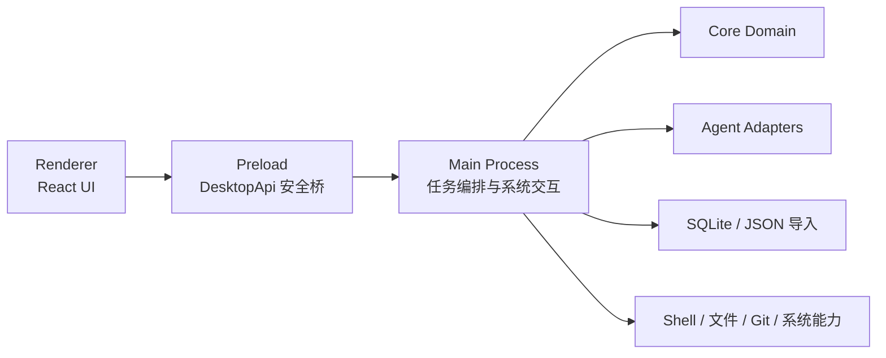
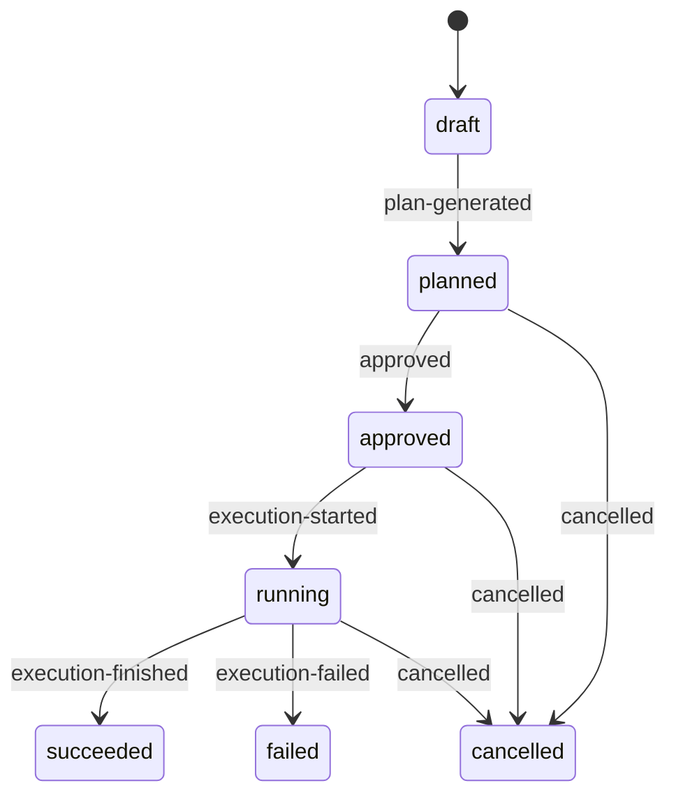
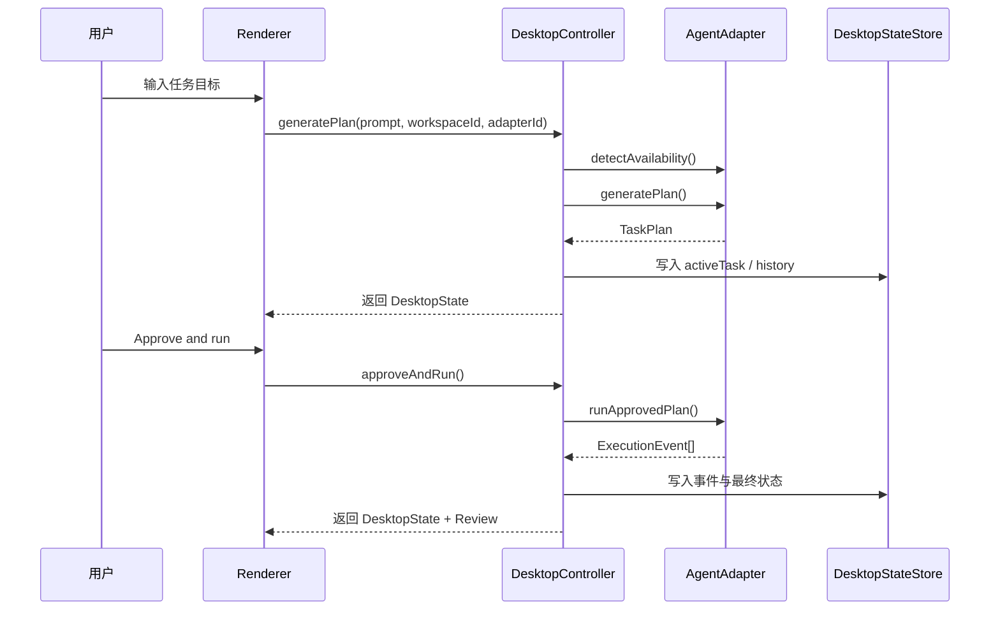

# 详细架构设计

## 一、文档目的

本文档是 Mango 当前代码骨架的详细架构说明，用于回答下面几个问题：

1. 当前仓库分成了哪些层，它们各自负责什么
2. 桌面端运行时是如何从用户输入走到任务执行的
3. 哪些模型、契约、存储和安全边界已经落地
4. 当前实现还有哪些有意保留的简化，以及下一阶段应如何演进

本文档优先描述 **当前真实实现与明确约束**，不是未来所有能力的愿景清单。若与其他文档配合阅读，建议顺序如下：

- 产品定位与范围见 `docs/product/*.md`
- 技术摘要见 `docs/product/technical-design.md`
- 架构总览见 `docs/engineering/technical-architecture.md`
- 模块职责与契约见 `docs/engineering/module-contracts.md`
- 存储与安全策略见 `docs/engineering/storage-and-security.md`

## 二、架构目标与设计原则

Mango 当前架构围绕一个非常明确的产品目标建立：

> 把开发者的本地任务执行做成一个 `Plan -> Approve -> Go -> Review` 的可信闭环。

为此，当前架构遵守以下原则：

### 1. 本地执行优先

Mango 首先是桌面端产品，不是云端协作平台。工作区、终端、文件系统、Git 状态和执行日志是当前主战场。

### 2. 主流程必须可见

任何关键阶段都不应该被隐藏在黑盒内部。计划、权限、执行事件和结果摘要都必须是结构化对象，而不是分散在聊天文本里。

### 3. UI、编排、领域、适配分层

渲染层负责交互与展示，主进程负责本地编排，`packages/core` 负责领域模型与状态机，`packages/adapters` 负责对接具体 CLI。这是 Mango 当前最重要的架构边界。

### 4. 先稳定契约，再扩展能力

任务状态、IPC DTO、执行事件、权限模型等公共契约一旦同时被 UI、持久化和适配器消费，就必须优先保证结构稳定。

### 5. 安全边界优先于“省事”

Renderer 不能直接访问 Node/Electron 能力，高风险能力必须经过显式权限模型，Preload 只暴露收敛后的桌面 API。

## 三、仓库分层与模块职责

当前仓库采用 `pnpm + turbo` Monorepo，按“应用入口 / 共享包 / 工具链 / 测试 / 文档 / 基础设施”分层组织。

### 3.1 顶层结构

| 目录                 | 作用                                    | 当前状态   |
| -------------------- | --------------------------------------- | ---------- |
| `apps/desktop`       | Electron 桌面应用                       | 当前主实现 |
| `apps/web`           | 未来 Web 工作台或官网入口               | 骨架预留   |
| `apps/api`           | 未来云端 API                            | 骨架预留   |
| `apps/worker`        | 未来异步任务执行器                      | 骨架预留   |
| `packages/core`      | 领域模型、状态机、权限与工作区模型      | 已落地     |
| `packages/adapters`  | 具体 Agent/CLI 适配器                   | 已落地     |
| `packages/contracts` | IPC / HTTP DTO、错误模型、共享契约      | 已落地     |
| `packages/ui`        | 共享 token 与 UI 基础资产               | 已落地     |
| `packages/config-*`  | TS、ESLint、Vitest、Playwright 共享配置 | 已落地     |
| `tooling`            | 脚本、生成器、结构检查工具              | 已落地     |
| `tests`              | 跨包测试、E2E、fixtures                 | 已建骨架   |
| `docs`               | 产品、设计、研发、质量、发布、流程文档  | 已落地     |
| `infra`              | Docker、GitHub、发布基础设施说明        | 已建骨架   |

### 3.2 关键共享包

#### `@mango/core`

承担所有与 UI 框架、Electron API 无关的领域定义，包括：

- `TaskSession`
- `TaskPlan`
- `ExecutionEvent`
- `TaskReview`
- `WorkspaceContext`
- `PermissionPolicy`
- `AgentAdapter` 接口

#### `@mango/contracts`

承担跨进程、跨模块共享的契约定义，包括：

- `MANGO_DESKTOP_CHANNELS`
- `DesktopApi`
- `DesktopState`
- `GeneratePlanInput`
- `ContractError`
- 未来 REST / OpenAPI 契约入口

#### `@mango/adapters`

承担对外部 Agent/CLI 的具体接入，当前包含：

- `ClaudeCodeCliAdapter`
- `MockClaudeCodeAdapter`
- `createDefaultAgentAdapters`

#### `@mango/ui`

承担跨桌面 / Web 的 UI 基础资产，目前主要是 design token，为后续复用做准备。

## 四、桌面端运行时架构

桌面端是当前系统的唯一完整运行入口，采用典型的 Electron 三层结构：

### 4.1 Main Process

主进程是当前系统的协调中心，负责：

- 启动桌面应用和窗口
- 初始化本地状态
- 注册 IPC handlers
- 管理任务编排
- 调用 adapter 生成计划和执行任务
- 读写本地持久化
- 刷新工作区环境信息

当前主进程里最关键的业务编排对象是 `DesktopController`，它承担了当前版本几乎全部“桌面工作流”的编排责任。

### 4.2 Preload

Preload 通过 `createDesktopApi()` 向渲染层暴露一组收敛后的方法：

- `bootstrap`
- `generatePlan`
- `approveAndRun`
- `openFeedback`

Preload 当前只做一件事：通过 `ipcRenderer.invoke` 桥接 IPC 调用。它不负责实现业务规则，也不维护业务状态。

### 4.3 Renderer

渲染层基于 React，当前 UI 核心位于 `features/task-workbench/TaskWorkbench.tsx`。它负责：

- 展示环境与工作区信息
- 接收任务 prompt
- 展示 `Plan / Approve / Go / Review`
- 展示执行时间线和回顾摘要
- 触发桌面 API 动作

当前 Renderer 明确不负责：

- 直接访问 Node/Electron API
- 自行维护权限决策规则
- 自行理解 CLI 结果格式

## 五、核心领域模型

Mango 的 UI 和持久化都不是围绕“消息列表”设计，而是围绕几个清晰的领域对象设计。

### 5.1 `TaskSession`

`TaskSession` 代表一次完整任务，其核心字段包括：

- `id`
- `adapterId`
- `prompt`
- `status`
- `workspace`
- `plan`
- `events`
- `executionSummary`
- `approvedBy`
- `createdAt`
- `updatedAt`

当前状态机固定为：

该状态机由 `packages/core/src/taskSession.ts` 统一约束，不允许越过关键阶段直接跳转。

### 5.2 `TaskPlan`

`TaskPlan` 是执行前的结构化计划，字段包括：

- `headline`
- `summary`
- `steps`
- `requestedPermissions`

当前产品交互要求用户在看到 `TaskPlan` 之前，不进入真实执行。

### 5.3 `ExecutionEvent`

当前事件模型统一为 4 类：

- `terminal.output`
- `file.change`
- `summary.ready`
- `tool.call`

每个事件至少包含：

- `id`
- `type`
- `level`
- `message`
- `createdAt`

这意味着 UI、回顾摘要、持久化和后续诊断都可以围绕同一事件流展开，而不需要为日志、文件变化、最终总结各造一套结构。

### 5.4 `WorkspaceContext`

当前工作区模型包含：

- `id`
- `name`
- `rootPath`
- `shell`
- `gitBranch`
- `gitStatusSummary`
- `envAllowList`
- `recentTaskIds`
- `providerConfig`

`DesktopController` 在启动和读取持久化状态时，会刷新工作区的 shell、Git 分支和 Git 状态摘要。

### 5.5 `PermissionPolicy`

当前权限模型围绕以下能力定义：

- `shell`
- `filesystem`
- `network`
- `browser`

系统会先评估计划里声明的权限请求，再向界面展示风险和是否需要批准。当前权限模型已经存在，但实际执行阶段仍是“任务级统一批准”，不是细粒度 capability grant。

## 六、桌面契约与跨进程通信

Renderer 不直接调用主进程内部对象，而是通过 `@mango/contracts` 定义好的 IPC channel 和 `DesktopApi` 访问。

### 6.1 当前桌面 IPC channels

- `mango:bootstrap`
- `mango:generate-plan`
- `mango:approve-and-run`
- `mango:open-feedback`

### 6.2 `DesktopState`

当前渲染层读取的整体状态对象包括：

- 产品信息：`productName`、`slogan`
- Adapter 状态：`adapters`
- 工作区：`workspaces`、`selectedWorkspaceId`
- 当前任务：`activeTask`
- 当前权限：`currentPermissions`
- 当前回顾：`review`
- 历史任务：`history`
- 设置：`settings`
- 环境信息：`environment`

这说明当前 UI 已经采用“单个桌面工作台状态快照”的设计，而不是由多个分散接口自行组装页面。

### 6.3 契约层原则

当前架构约束要求：

- channel 名称集中放在 `@mango/contracts`
- Renderer 只消费 `DesktopApi`
- 错误模型使用统一 DTO 表达
- 不在应用内部复制一份同义接口类型

## 七、任务执行主链路

当前主链路由 `DesktopController` 串起，核心流程如下：

### 7.1 启动阶段

`bootstrap()` 会：

1. 读取持久化状态
2. 若无状态则生成默认工作区
3. 刷新工作区 shell、分支和 Git 改动摘要
4. 检测所有已注册 adapter 的可用性
5. 评估当前任务的权限请求
6. 组装 `DesktopState`

### 7.2 生成计划阶段

`generatePlan()` 会：

1. 读取持久化状态
2. 选择当前工作区
3. 检查 adapter 是否存在且可用
4. 创建新的 `TaskSession`
5. 调用 adapter 的 `generatePlan()`
6. 把任务从 `draft` 推进到 `planned`
7. 写回 `activeTask`、`history`、`selectedWorkspaceId`

### 7.3 批准并执行阶段

`approveAndRun()` 会：

1. 确认当前存在 `activeTask.plan`
2. 若任务仍是 `planned`，则写入 `approved`
3. 再推进到 `running`
4. 调用 adapter 的 `runApprovedPlan()`
5. 逐条追加 `ExecutionEvent`
6. 根据结果推进到 `succeeded` 或 `failed`
7. 基于事件构建 `TaskReview`
8. 写回持久化存储

### 7.4 当前链路的刻意简化

当前链路为了先跑通主闭环，保留了这些简化：

- `approveAndRun()` 仍是整体任务批准，不是逐条权限决策
- 执行事件是一次性返回数组，不是流式推送
- `TaskReview.changedFiles` 依赖 `file.change` 事件，而真实 CLI 适配器当前尚未生成这类事件
- 当前 UI 只有一个“生成计划”和一个“批准执行”动作，尚未提供取消、恢复、重试等完整控制面

## 八、Adapter 架构

Adapter 层的目标是让 Mango 可以替换底层执行器，而不破坏桌面产品体验和领域模型。

### 8.1 `AgentAdapter` 接口

当前所有 adapter 必须提供：

- `detectAvailability()`
- `generatePlan()`
- `runApprovedPlan()`

这三个方法分别对应：

- 是否可用
- 如何先生成结构化计划
- 在批准后如何执行并回传事件

### 8.2 当前默认 adapter 组合

`createDefaultAgentAdapters()` 当前注册了两个适配器：

- `ClaudeCodeCliAdapter`
- `MockClaudeCodeAdapter`

这意味着 Mango 当前已经从“只有 mock”演进到“真实 CLI + mock 共存”的状态。实际运行时，如果 `claude --version` 不可用，系统会把真实 adapter 标记为 unavailable。

### 8.3 `ClaudeCodeCliAdapter` 当前行为

当前 `ClaudeCodeCliAdapter` 的实现方式是：

- 用 `claude --version` 检查 CLI 是否存在
- 用 `claude -p ... --json-schema ...` 生成结构化计划
- 用 `claude -p ... --dangerously-skip-permissions` 执行已批准任务

当前它能稳定返回：

- 一个结构化 `TaskPlan`
- 一个 `terminal.output` 事件
- 一个 `summary.ready` 事件

当前它还没有完整产出：

- 逐步流式事件
- 文件变化事件
- 工具调用事件
- 更细粒度的执行诊断

因此，当前真实 CLI adapter 已经能验证主链路，但还没有把 Mango 的全部“可见执行能力”填满。

## 九、数据存储与迁移设计

当前持久化层采用“`SQLite 主存储 + JSON 导入兜底`”策略。

### 9.1 当前存储抽象

主进程编排不直接耦合具体文件格式，而是依赖 `DesktopStateStore`：

- `read(): Promise<PersistedDesktopState | null>`
- `write(state): Promise<void>`

这使得当前系统可以在 `FileDesktopStore` 和 `SQLiteDesktopStore` 之间切换，而不影响 `DesktopController` 的编排逻辑。

### 9.2 `PersistedDesktopState`

当前落盘状态包括：

- `schemaVersion`
- `activeTask`
- `history`
- `settings`
- `selectedWorkspaceId`
- `workspaces`

### 9.3 SQLite 当前职责

当前 SQLite 已承担正式主存储职责，保存的数据实体包括：

- `workspaces`
- `task_sessions`
- `execution_events`
- `desktop_settings`

它还具备：

- `schemaVersion`
- migration catalog
- 首个 migration 基线
- 首次读取空库时自动导入旧 JSON 状态

### 9.4 当前存储策略的价值

相比早期 JSON 持久化，SQLite 让 Mango 更适合继续扩展：

- 能按任务、事件、工作区做结构化查询
- 能支撑历史记录和恢复能力
- 能引入 migration 和版本演进
- 能为后续索引、统计、审计打基础

### 9.5 当前仍未完成的存储能力

- 更细的查询索引和性能优化
- 数据损坏检测与修复工具
- 更完整的任务恢复机制
- 更强的审计与导出能力

## 十、安全与权限模型

Mango 当前的安全边界并不复杂，但方向是清楚的。

### 10.1 当前安全边界

- Renderer 禁止直接访问 Node/Electron 能力
- Preload 只暴露收敛后的 `DesktopApi`
- Main 承担系统能力调用与任务编排
- 高风险能力统一纳入权限模型

### 10.2 当前权限评估

计划中的 `requestedPermissions` 会在主进程内通过 `PermissionPolicy` 评估，形成：

- capability
- reason
- risk
- label
- requiresApproval

这些结果会进入 `DesktopState.currentPermissions`，由 UI 展示给用户。

### 10.3 当前安全能力的边界

当前版本已经有“计划先看、权限先评估、执行再开始”的结构，但还没有做到：

- 工作区级权限作用域
- 逐类能力的单独批准与拒绝
- 敏感目录保护
- 删除类操作的专门防护
- 更细的网络访问控制
- 完整审计轨迹

因此，当前权限模型更准确的描述是：

> 已建立统一表达与评估机制，但执行控制仍是第一阶段实现。

## 十一、当前 UI 架构与信息组织

当前 Renderer 的核心页面结构与产品信息架构保持一致，主要分成三块：

### 11.1 左侧栏

- 品牌信息
- 环境信息
- 工作区列表

### 11.2 主内容上半区

- Hero 区
- 执行闭环提示
- 任务输入区
- 计划区

### 11.3 主内容下半区

- 执行时间线
- 结果回顾

当前 `TaskWorkbench` 已经能完整显示 `Plan / Approve / Go / Review` 的骨架，但工作区管理、历史筛选、失败恢复和更细粒度回顾仍处于后续增强范围。

## 十二、测试与质量保障

当前仓库已经建立一套适合“产品骨架期”的基础质量门禁：

- `pnpm lint`
- `pnpm format:check`
- `pnpm architecture-check`
- `pnpm test`
- `pnpm check:contracts`
- `pnpm typecheck`
- `pnpm build`
- `pnpm smoke:desktop`
- `pnpm verify`

当前测试覆盖面主要包括：

- `packages/core` 的状态机与权限逻辑
- `packages/adapters` 的 adapter 行为
- `packages/contracts` 的契约一致性
- `apps/desktop` 的持久化与控制器逻辑
- Renderer 的基础界面测试

这意味着 Mango 当前已经具备“改文档、改模型、改骨架时能得到快速反馈”的基本条件。

## 十三、当前已落地能力与缺口

### 13.1 已落地

- `pnpm + turbo` Monorepo 底座
- Electron + React + TypeScript 桌面壳
- Main / Preload / Renderer 分层
- 领域状态机与任务模型
- IPC 契约层
- 真实 CLI adapter 与 mock adapter 共存
- SQLite 主存储和 JSON 导入迁移
- 基础测试、构建、类型检查和结构校验链路

### 13.2 仍是骨架或缺口

- 执行事件仍非流式
- 文件变更与工具调用可见性不足
- 权限控制尚未做到细粒度授权
- 取消、恢复、失败重试尚未完整落地
- 工作区管理仍偏基础
- Review 面板证据仍偏少
- 多 adapter 策略和选择体验仍较初级
- 云端入口仍是预留骨架

## 十四、建议的演进顺序

结合当前架构，后续演进建议按下面顺序推进：

1. 先把真实 CLI adapter 事件能力补强  
   目标是让执行阶段真正产生更丰富的 `ExecutionEvent`。

2. 再把权限从“展示”升级为“真正控制点”  
   包括更清晰的批准对象、风险说明和拒绝后的行为。

3. 再补任务恢复、失败重试、取消控制  
   这是从“能跑一次”走向“真实可用”的关键。

4. 再增强工作区与回顾能力  
   包括最近工作区、状态刷新、差异展示和历史检索。

5. 最后再逐步扩展 Web / API / Worker  
   在桌面本地主链路没有稳定前，不建议提前转移重点。

## 十五、评审清单

当后续有人修改 Mango 架构相关代码时，建议至少检查以下问题：

- 这次改动属于哪一层，是否放到了正确目录
- Renderer 是否仍然只通过 `DesktopApi` 访问桌面能力
- 新增公共字段是否同步更新了 contracts、测试和文档
- 状态机是否仍然遵守 `draft -> planned -> approved -> running -> terminal`
- 执行事件是否仍然统一归入 `ExecutionEvent`
- 新的存储字段是否同步考虑了 SQLite migration
- 新增能力是否破坏了当前安全边界

## 十六、结论

Mango 当前已经完成的，不只是一个桌面 UI，而是一套足以继续演进的架构骨架：

- 运行时边界是清楚的
- 领域模型是统一的
- 契约层是存在的
- 持久化已经从临时方案进入正式方案
- 真实 CLI 接入已经开始，而不是停留在纯 mock

但它仍然处在“主闭环已打通，执行深度与控制精度仍需增强”的阶段。后续所有研发工作，都应围绕这个事实推进，而不是把它误判成一个已经完成 Beta 能力的成熟系统。
